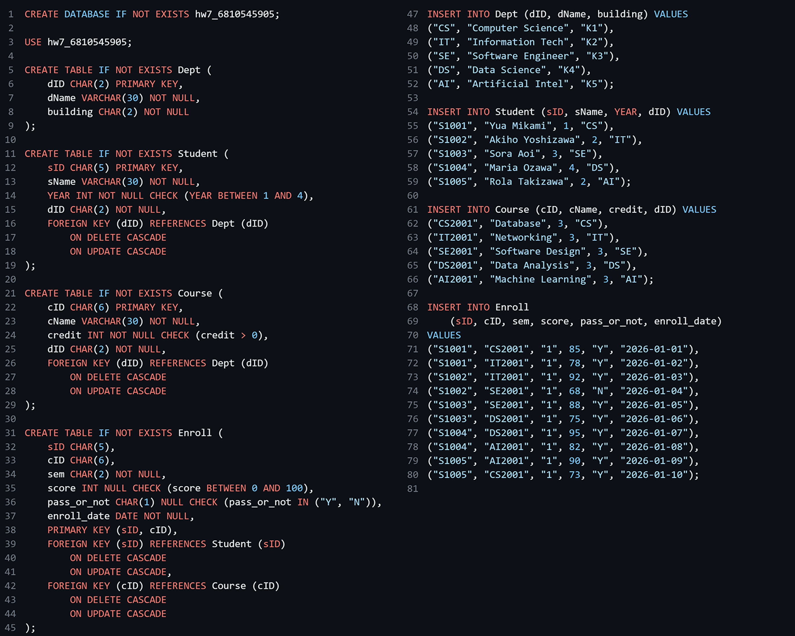
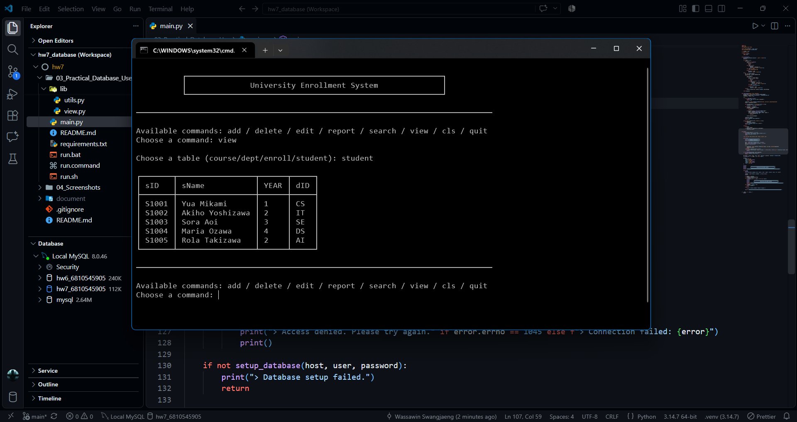
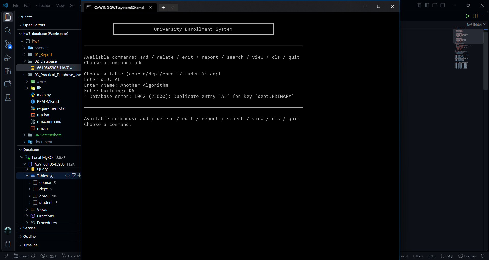
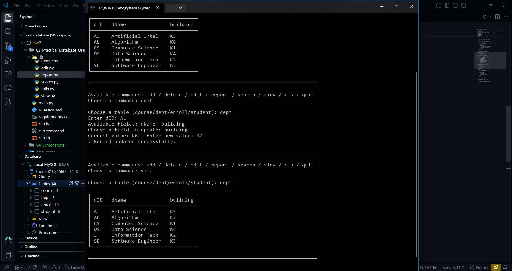
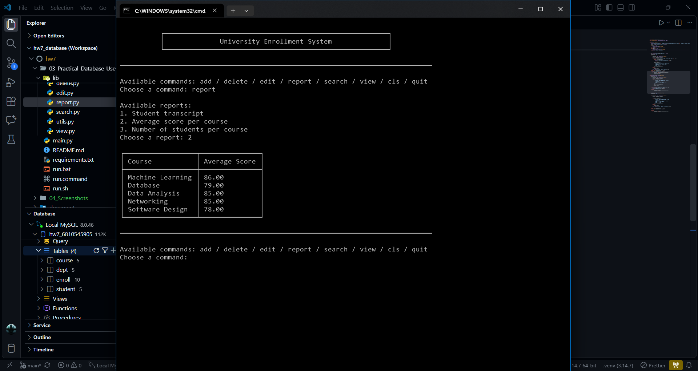
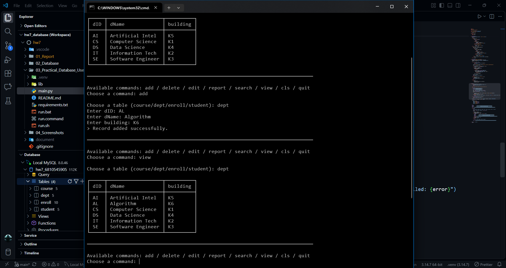

# HW7 Database CLI - University Enrollment System

**Selected Practical Database Use Option: Option C - Simple Database Application**

This project implements a command-line application using Python and MySQL. It allows users to manage university departments, students, courses, and enrollments through database operations and meaningful reports.

## 1. Project Overview

The University Enrollment System is a command-line application designed to manage university enrollment information.

The system manages:

- Department information
- Student information
- Course information
- Student course enrollments, including scores and enrollment dates

The application allows users to perform database operations without writing SQL statements directly.

## 2. Technologies Used

| Technology             | Purpose                                         |
| ---------------------- | ----------------------------------------------- |
| Python                 | Application development                         |
| MySQL                  | Relational database management                  |
| mysql-connector-python | Connects Python to MySQL                        |
| SQL                    | Database creation, queries, and data management |

## 3. Database Design

The database is named `hw7_6810545905` and contains four related tables.

| Table     | Description                                                         |
| --------- | ------------------------------------------------------------------- |
| `Dept`    | Stores department names and building information                    |
| `Student` | Stores student information and department membership                |
| `Course`  | Stores course information and department membership                 |
| `Enroll`  | Stores student enrollments, semesters, scores, and enrollment dates |

### Business Rules

1. A department can have many students, but each student belongs to exactly one department.
2. A department can offer many courses, but each course belongs to exactly one department.
3. A student can enroll in many courses, and a course can have many students enrolled in it.
4. Each enrollment records the semester, score, and pass/fail status for the corresponding student-course pair.
5. A student cannot enroll in the same course more than once.
6. A course must belong to an existing department.
7. An enrollment score, if provided, must be between 0 and 100.

## 4. Application Features

The application provides the following database operations:

| Command  | Description                          |
| -------- | ------------------------------------ |
| `add`    | Add a new record                     |
| `view`   | Display records                      |
| `search` | Search for records                   |
| `edit`   | Update an existing record            |
| `delete` | Delete records or reset the database |
| `report` | Generate reports                     |
| `quit`   | Exit the application                 |

### Reports

The application provides three reports using joined or aggregated database data:

1. **Student Transcript** - Displays a student's enrolled courses, scores, and pass results.
2. **Average Score per Course** - Calculates the average score for each course.
3. **Number of Students per Course** - Counts the number of students enrolled in each course.

These reports provide information about student performance, course scores, and enrollment numbers.

## 5. Project Structure

```text
6810545905_HW7_Database_CLI/
├── 01_Report/
│   └── 6810545905_HW7_Report.pdf
├── 02_Database/
│   └── 6810545905_HW7.sql
├── 03_Practical_Database_Use/
│   ├── lib/
│   │   ├── __init__.py
│   │   ├── add.py
│   │   ├── config.py
│   │   ├── delete.py
│   │   ├── edit.py
│   │   ├── report.py
│   │   ├── search.py
│   │   ├── utils.py
│   │   └── view.py
│   ├── main.py
│   ├── README.md
│   ├── requirements.txt
│   ├── run.bat
│   ├── run.command
│   └── run.sh
├── 04_Screenshots/
│   ├── add.png
│   ├── application.png
│   ├── constraint.png
│   ├── implementation.png
│   ├── join.png
│   └── update.png
└── README.md
```

## 6. Requirements

Before running the application, make sure you have:

- Python 3.14
- MySQL 8.0 installed and running
- A MySQL account with permission to create and modify the project database
- A terminal or command prompt

The application requires Python 3.14 and checks the Python version when starting.

## 7. Installation and Setup

### Step 1: Clone the repository

Clone the project from GitHub and navigate to the application directory.

Windows:

```
git clone https://github.com/CYRTRUS/6810545905_HW7_Database_CLI.git
cd 6810545905_HW7_Database_CLI\03_Practical_Database_Use
```

macOS / Linux:

```
git clone https://github.com/CYRTRUS/6810545905_HW7_Database_CLI.git
cd 6810545905_HW7_Database_CLI/03_Practical_Database_Use
```

### Step 2: Create a virtual environment

Create a virtual environment to keep the project's Python dependencies separate from those of other Python projects.

Windows:

```
python -m venv .venv
```

macOS / Linux:

```
python3 -m venv .venv
```

### Step 3: Install dependencies

Install the required Python packages into the virtual environment using the provided `requirements.txt` file.

Windows:

```
.venv\Scripts\python.exe -m pip install -r requirements.txt
```

macOS / Linux:

```
./.venv/bin/python -m pip install -r requirements.txt
```

### Step 4: Start MySQL Server

Make sure MySQL Server is installed and running before starting the application.

### Step 5: Run the application

Windows:

Run the following command:

```
run.bat
```

Alternatively, double-click `run.bat` in File Explorer or run the application directly:

```
.venv\Scripts\python.exe main.py
```

macOS / Linux:

Make the launch scripts executable, then run `run.sh`:

```
chmod +x run.sh run.command
./run.sh
```

Alternatively, run the application directly:

```
./.venv/bin/python main.py
```

On macOS, you can also double-click `run.command` in Finder. On Linux, you can run `run.sh` from a terminal or use your file manager's option to execute the script, if supported.

If the active Python interpreter is not version 3.14, the application prints an error and exits immediately, before asking for any database connection details.

## 8. Connecting to MySQL

When the application starts, enter the following information:

1. MySQL host, such as `localhost`
2. MySQL username, such as `root`
3. MySQL password

The password is entered using masked characters.

After connecting, the application automatically executes the SQL setup script:

```text
02_Database/6810545905_HW7.sql
```

The setup script creates the database and tables if they do not already exist. It also inserts sample data when the corresponding tables are empty.

The database name is configured in `lib/config.py`:

```python
DATABASE_NAME = "hw7_6810545905"
```

## 9. Using the Application

After the database setup is complete, the main menu displays the available commands.

```text
Available commands: add / delete / edit / report / search / view / cls / quit
```

Enter a command to perform the corresponding operation.

### Adding an Enrollment

When adding an enrollment, enter:

- Student ID
- Course ID
- Semester
- Enrollment date

The enrollment date must use the format `DD-MM-YYYY`.

Example:

```text
15-01-2026
```

The enrollment score and pass result are handled as nullable fields.

### Generating a Report

Enter:

```text
report
```

Then select one of the available reports:

```text
1. Student transcript
2. Average score per course
3. Number of students per course
```

For a student transcript, enter the student's ID when prompted.

## 10. Screenshots and Demonstration

The following screenshots demonstrate the database implementation and application operations.

### Database Implementation



### Application Demonstration



### Database Constraint Testing



### Database Update



### Joined Data



### Adding Records



## 11. Notes

- The project demonstrates Option C: Simple Database Application.
- The database schema and sample data are provided in `02_Database/6810545905_HW7.sql`.
- The application source code is located in `03_Practical_Database_Use/`.
- The project uses four related tables to manage university enrollment information.
- The application uses a command-line interface and does not require authentication, deployment, or an advanced graphical interface.
